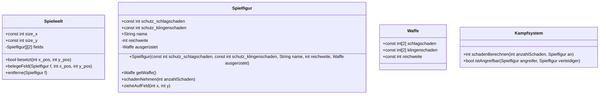

# OOP anhand eines Spiels

## Ziel

Ein einfaches 2D-Spiel in dem ein Spieler rundenbasiert Monster besiegen kann.

## Leitfragen

### Abstraktion: Komplexität reduzieren

- Was ist die Verantwortung dieser Klasse?
- Gibt es eine höhere Ebene (Vererbung)
- Welche Daten/Methoden sind für Nutzer relevant?
- Welche Daten/Methoden sind interne Details?

### Kapselung: Innere Zustände schützen, Invarianten einhalten

- Welche Invarianten müssen immer gelten?
- Welche Attribute/Felder sollen nicht direkt änderbar sein?
- Wie kann das Objekt von Außen in einen ungültigen Zustand kommen?
- Welche Methoden sind Teil des öffentlichen Vertrags? Was ist nur Hilfslogik

### Vererbung: Gemeinsames Verhalten teilen über echte Beziehungen

folgt

### Polymorphismus: Wie vermeiden wir Typ-Checks durch einheitliche Aufrufe?

folgt

## Regeln

### Bewegung/Spielfeld

- X ist horizontal
- Y ist vertikal

**Beispiel**

- Spieler (S) mit `X = 0, Y = 0`
- Gegner (G) mit `X = 2, Y = 1`
- 3 mal 3 Feld:

```
S  
  X
   
```

Alles wird als Spielfigur dargestellt. Sie ist nullable.

### Kampf

- Waffen:
- Spieler:
- Monster/Gegner:

## Klassen




## Contributions für Umschüler (wie mache ich mit?)

1. Du bekommst eine `.bundle` Datei von mir.
2. Klone und wechsle in das Verzeichnis:
```
git clone dateiname.bundle dateiname-deineID
cd dateiname-deineID
``` 
3. Setze zur Sicherheit Deinen Namen und Deine E-Mail
```
git config user.name "Max Mustermann"
git config user.email "max@example.com"
```

2. Du wechselst auf Deinen Branch (benannt nach internen ID): `git checkout -b submission/deineID`
3. Du beginnst an den Aufgaben zu arbeiten. Zwischendurch `git status` prüfen. Dann nach getesteten, sinnvollen Änderungen:
```
git add .
git commit -m "sinnvolle Beschreibung, was du geändert hast"
```
4. Den Commit-Verlauf kannst Du Dir z.B. so ansehen: `git log --oneline --decorate --graph`
5. Wenn Du es mit uns teilen willst, bundle erzeugen: `git bundle create deineID-01.bundle submission/deineID` wobei `01` frei wählbar ist, aber am besten beschreibt, zu welchem Zeitpuntk z.B. Wochentag, das gemacht wurde.
6. Du prüfst, ob es sauber geklappt hat: `git bundle verify deineID-01.bundle`
7. Du gibst die erstellte Datei an mich: `deineID-01.bundle`

Rausfinden, auf welchem Branch Du Dich befindest kannst Du mit `git branch --show-current`
